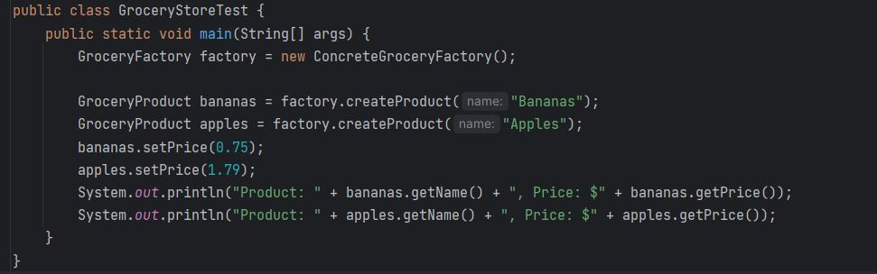

# SOFE-3650U-100820450
Assignment Group 17 
# SOFE-3650U

# Assignment 1: Design Patterns

## Group #17

### David Hanna 100828635
### Hasan Khan 100820450
### Abdullah Ahmed 100821709


## Project Overview

- [Repository Structure](#repository-structure)
- [UML Diagram](#uml-diagram)
- [Test Driver](#test-driver)

---

## Repository Structure

```
- ASSIGNMENT_GRP_17
	- image
		- output.jpg
		- test.jpg
		- uml.png
	- src
         	-read.txt
		-Apples.java
		-Bananas.java
        	-ConcreteGroceryFactory.java
        	-GroceryFactory.java
        	-GroceryProduct.java
       	 	-GroceryStoreTest.java

```

## UML Diagram


## Test Driver

> data.txt



---
## Test Class

> GroceryStoreTest.java

```
public class GroceryStoreTest {
    public static void main(String[] args) {
        GroceryFactory factory = new ConcreteGroceryFactory();

        GroceryProduct bananas = factory.createProduct("Bananas");
        GroceryProduct apples = factory.createProduct("Apples");
        bananas.setPrice(0.75);
        apples.setPrice(1.79);
        System.out.println("Product: " + bananas.getName() + ", Price: $" + bananas.getPrice());
        System.out.println("Product: " + apples.getName() + ", Price: $" + apples.getPrice());
    }
}

```

## Overview

In this project, we have implemented a grocery store product creation system with the following components:

1. **GroceryProduct Interface**: This is the main interface that all grocery products must implement. It defines methods for getting the product's name, getting its price, and setting the price.

2. **Concrete Grocery Products (e.g., Bananas and Apples)**: These are concrete classes that implement the `GroceryProduct` interface. Each product has a name and a price. The price is set after the product is created and is read from a database (a text file).

3. **GroceryFactory Interface**: This is an abstract factory interface that declares a method for creating grocery products.

4. **Concrete GroceryFactory (ConcreteGroceryFactory)**: This is a concrete factory class that implements the `GroceryFactory` interface. It reads product prices from a text file ("read.txt") and creates grocery products (e.g., Bananas and Apples) with their corresponding prices.

5. **Test Driver (GroceryStoreTest)**: This is a test driver class that demonstrates the functionality of the system. It creates instances of grocery products (e.g., Bananas and Apples) using the `ConcreteGroceryFactory` and displays their names and prices.

## Usage

1. Clone or download this repository to your local machine.

2. Ensure you have a text file named "read.txt" in the project directory. This file should contain product names and their corresponding prices in the format: `Product_Name: Price`.

   Example "read.txt":

## Output
> test.java | Output
---

